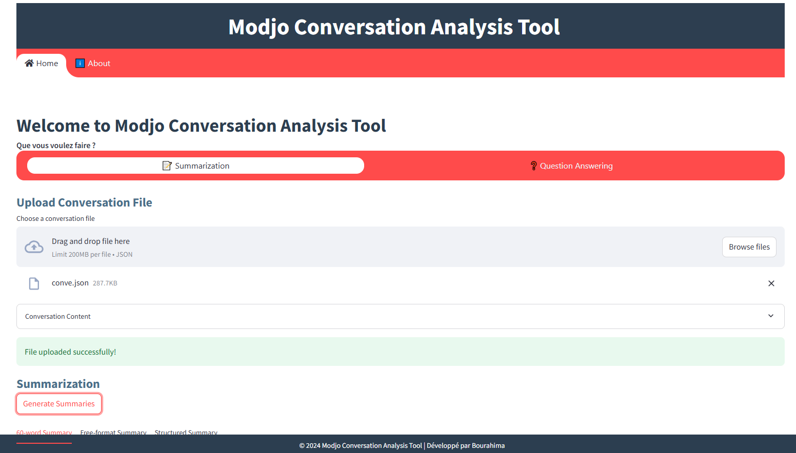
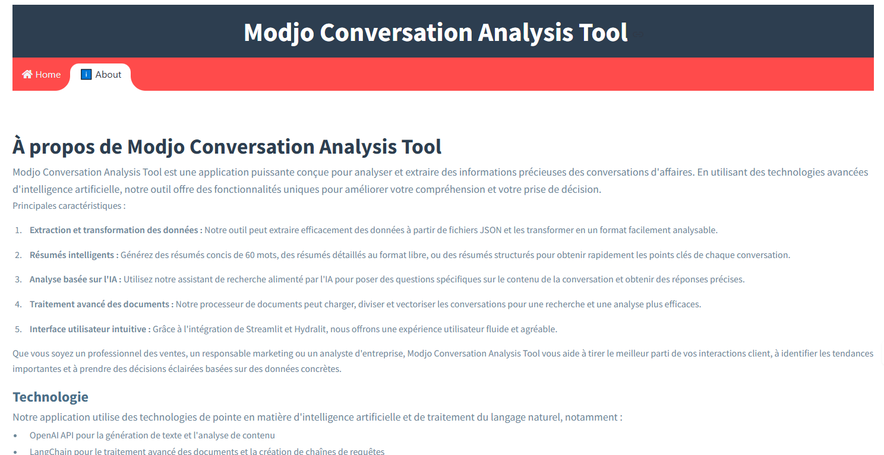

# Modjo Conversation Analysis Tool

## Overview
This Streamlit application provides an interface for analyzing conversation data using advanced NLP techniques.
It offers features such as conversation summarization and question-answering capabilities based on the conversation content.

## Features
- Upload and process JSON conversation data
- Generate three types of summaries:
  - 60-word summary
  - Free-format summary
  - Structured summary
- Answer questions about the conversation using two different AI models

## Installation

### Prerequisites
- Python 3.9+

### Setup
1. Install the required packages:
   ```
   pip install -r requirements.txt
   ```

2. Set up your OpenAI API key:
   Create a `.env` file in the root directory and add your OpenAI API key:
   ```
   OPENAI_API_KEY=your-api-key-here
   ```

## Usage

1. Run the Streamlit app:
   ```
   streamlit run app.py
   ```

2. Open your web browser and go to the URL displayed in the terminal (usually `http://localhost:8501`).

3. Use the interface to:
   - Upload a JSON file containing conversation data
   - Generate summaries
   - Ask questions about the conversation

## Components

- `DataExtractor`: Processes JSON conversation data
- `OpenAIClient`: Manages interactions with the OpenAI API
- `Summarizer`: Generates different types of summaries
- `MarketingResearchAssistant_v1`: Implements a simple question-answering method
- `MarketingResearchAssistant_v2`: Uses a retrieval chain for more precise answers
- `DocumentProcessor`: Handles document loading and vector store creation

## File Structure
```
modjo-conversation-analysis/
│
├── app.py              # Main Streamlit application
├── src/functions.py    # Core functionality and classes
├── requirements.txt    # Python dependencies
├── .env                # Environment variables (not in repo)
└── README.md           # This file
```